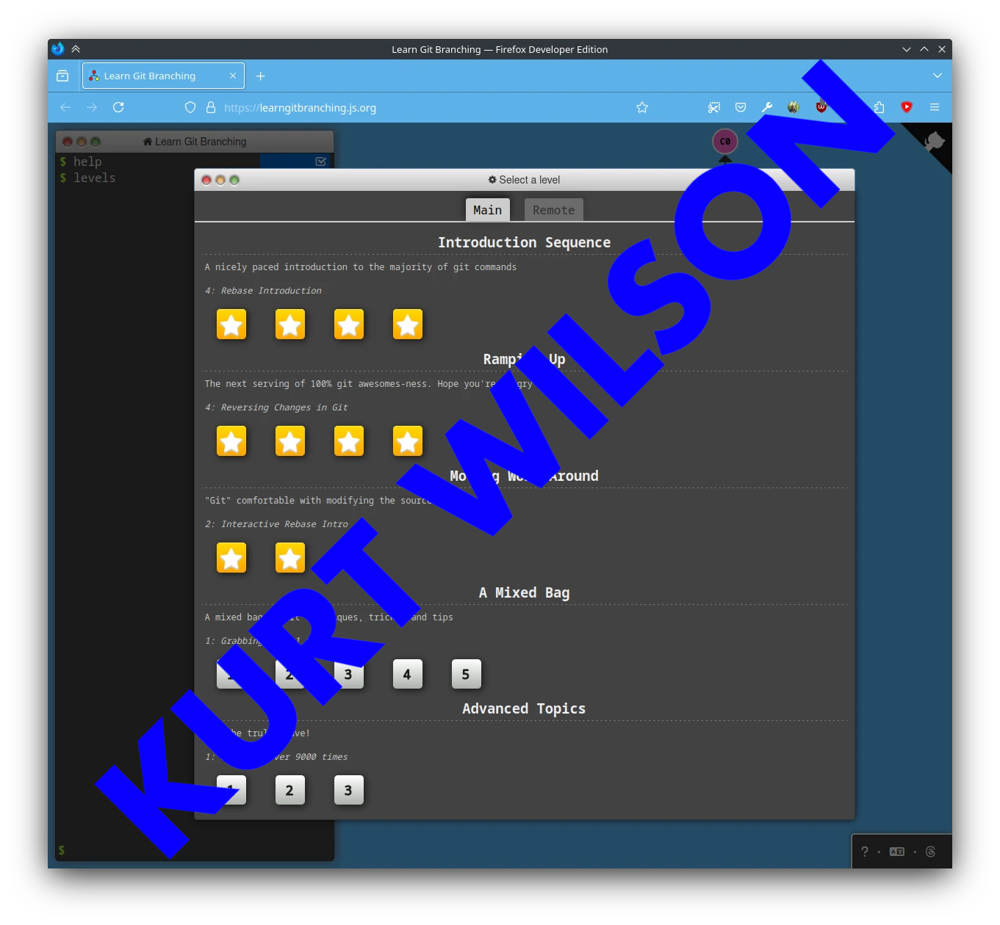
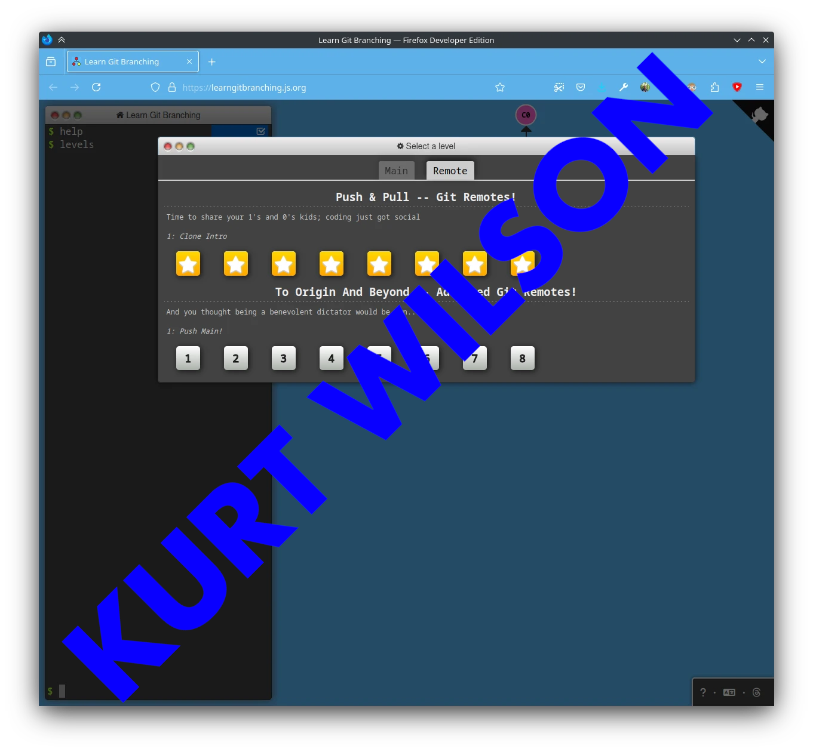

 

# Group 20 - HW2 CSC510 SPR'25

## Introduction
This HW is done by Group 20, where the main objective is to get comfortable with using various git commands and working with various branches as a team .

##### ✅ Task List  
- [x] Task 1: Complete Git Tutorial 
- [x] Task 2: Add Screenshots to `README.md`  
- [ ] Task 3: Modify `.html` File  
- [ ] Task 4: Merge latest changes  
- [ ] Task 5: Review pull requests 

## Git Tutorial

